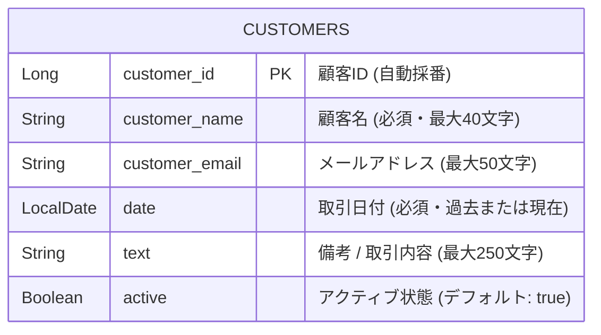

# 取引・顧客管理システム (Admin App)

Spring Boot と Thymeleaf を使用して構築された、管理者向けの取引・顧客情報管理 Web アプリケーションです。
顧客情報の登録・編集・削除・一覧表示に加え、キーワード検索、ステータス絞り込み、動的ソート、ページネーション機能を備えています。

---

##  主要機能

- **顧客・取引情報管理 (CRUD)**
  - **一覧表示**: 登録された顧客・取引データをページネーション付きで一覧表示
  - **新規登録**: 入力チェック（バリデーション）付きの登録フォーム
  - **編集・更新**: 既存データの編集および状態更新
  - **削除**: 誤操作防止の確認ダイアログ付き削除機能
- **検索・絞り込み・ソート**
  - **あいまい検索**: 顧客名による部分一致検索
  - **ステータス検索**: アクティブ / 非アクティブ状態での絞り込み
  - **動的ソート**: ID、顧客名、日付による昇順・降順並び替え
- **バリデーション & UI/UX**
  - 入力漏れ防止（顧客名・日付の必須チェック）
  - 日付入力制限（現在および過去の日付のみ許容）
  - ローディング表示および操作結果のアラート通知

---

## 使用技術 (Tech Stack)

### バックエンド
- **Java**: 17+
- **Framework**: Spring Boot 3.x
  - Spring Data JPA
  - Spring Validation
  - Spring MVC

### フロントエンド
- **Template Engine**: Thymeleaf
- **HTML5 / CSS3 / JavaScript** (Vanilla JS)

### データベース
- PostgreSQL / H2 Database (環境に応じて変更可能)

---

##  データベース設計 (ER図)



---
##  ファイル構成
```ファイル構成
src/main/java/com/crm/admin_app/
├── AdminAppApplication.java      # メインアプリケーションクラス
├── CustomerEntity.java          # 顧客データモデル（バリデーション・JPAアノテーション）
├── CustomerRepository.java      # Spring Data JPA リポジトリ（検索クエリ定義）
├── CustomerService.java         # ビジネスロジック（トランザクション管理・ソート・ページング）
├── CustomerController.java      # 顧客管理用Webコントローラー
└── admin_app.java               # 画面遷移用サブコントローラー

src/main/resources/templates/
├── index.html                   # 顧客一覧画面（検索・ソート・ページネーション）
├── create.html                  # 新規登録画面
└── edit.html                    # 編集画面
```
---
## ポイント
Spring Data JPA の Pageable を活用した動的なソート・ページネーション

サーバーサイドで PageRequest と Sort を組み合わせて発行することで、大量の顧客データが存在する場合でもメモリを圧迫せず、必要な件数（1ページ5件等）のみをDBから効率的に取得しています。また、カラム（ID、顧客名、日付）ごとの昇順・降順切り替えを柔軟に行える設計にしています。

JavaScript と HTML5 属性によるフロント＋バックエンド両系での日付バリデーション

バックエンドでは @PastOrPresent アノテーションを用いて「未来日付の登録」を防ぎ、整合性を担保しています。

さらにフロントエンド（JavaScript）でも画面読み込み時に date 入力欄の max 属性へ当日日付を動的セットすることで、ユーザーがカレンダーUI上で最初から未来日を選択できないようUX上の配慮（二重の防御策）を行っています。

登録・更新失敗時に入力値を保持したまま再表示するエラーハンドリング

単純なリダイレクト処理（redirect:）を行うとバリデーションエラー時にユーザーが入力した内容が消えてしまいます。本システムでは @Valid によるチェックエラー検知時、リダイレクトさせずにモデルに入力情報とエラーメッセージを載せて直接 View テンプレートを返却する設計にしています。これにより、誤入力があった際も入力途中のデータを維持したままスムーズに再修正できます。

---
## 起動方法
リポジトリをクローンします。
```
git clone [https://github.com/username/admin_app.git](https://github.com/username/admin_app.git)
cd admin_app
```
アプリケーションを起動します。
### macOS / Linux
```
./mvnw spring-boot:run
```
### Windows (PowerShell)
```
.\mvnw.cmd spring-boot:run
```
ブラウザで以下のURLにアクセスします。
```
http://localhost:8080/ 
```
